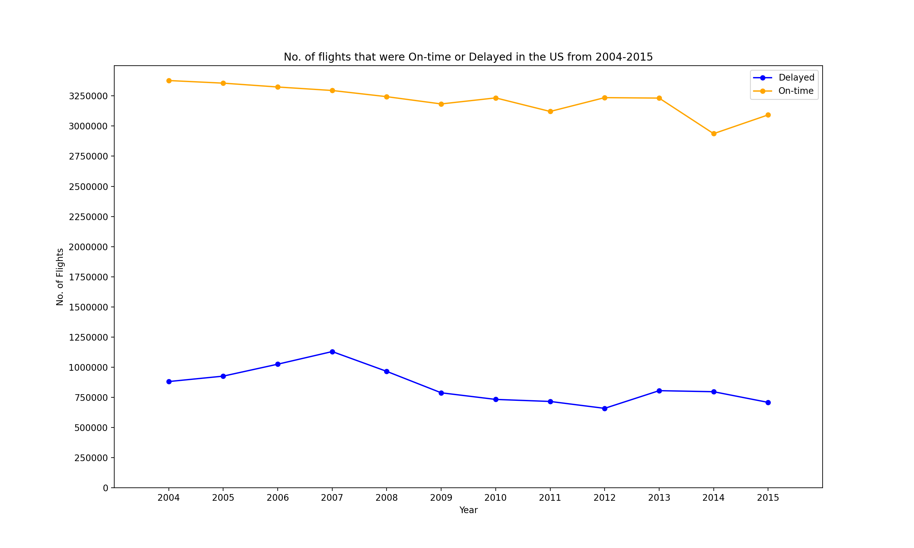
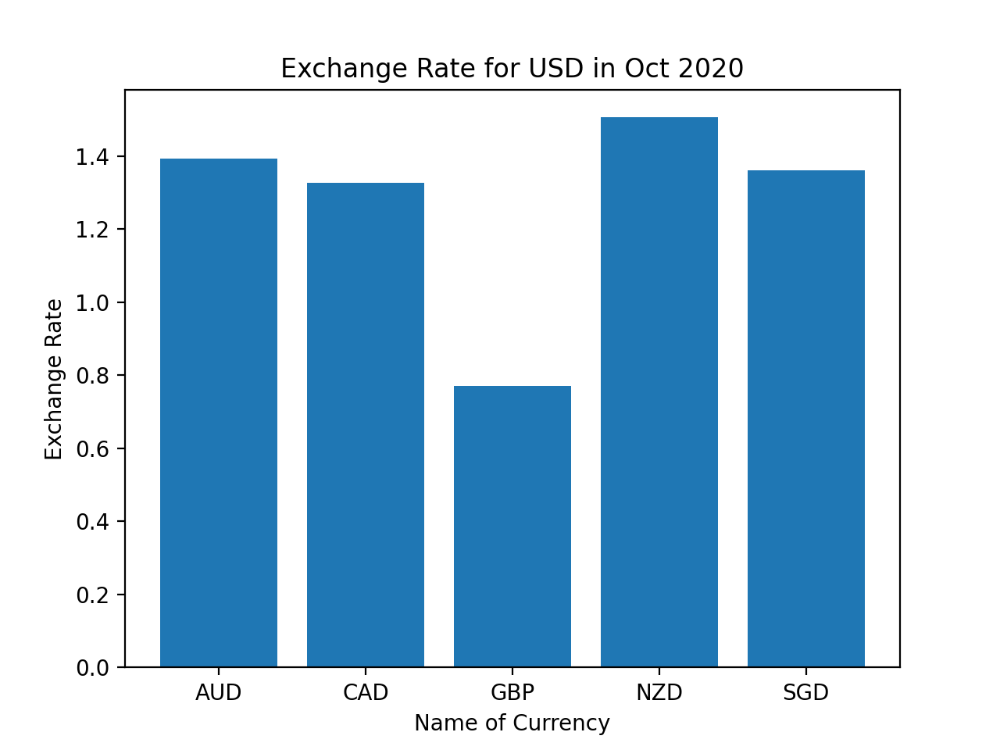

# Homework 2: Visualizing interesting datasets

## Graph 1: No. of flights that were On-time or Delayed in the US from 2004-2015

This graph shows the total number of flights that were on-time or delayed in the US between 2004 and 2015. From this graph, we can easily tell that most flights were on-time with an average difference of about 2,000,000 flights between flights that were on-time or delayed. The data used to create this plot included all major airports across the US such as Logan International, Washington Dulles International, and John F. Kennedy International. [You can find the orignal data here!](https://github.com/jdorfman/awesome-json-datasets) 

## Graph 2: Exchange Rate for USD in October 2020

This bar graph shows the exchange rate for USD for some popular currencies. The x-axis provides the names of the currencies and the y-axis indicates the value of the exchange rate for $1 USD. For example, 1 USD would be equal to 1.4 AUD. The data used to create this plot included all major currencies of the world, but I chose to depict currencies that I have used or am familiar with. [You can find the original data here!](https://github.com/jdorfman/awesome-json-datasets) 

[Here's a link to the webpage for the instructions for this project](https://github.com/mikeizbicki/cmc-csci040/tree/2020fall/hw_02)
